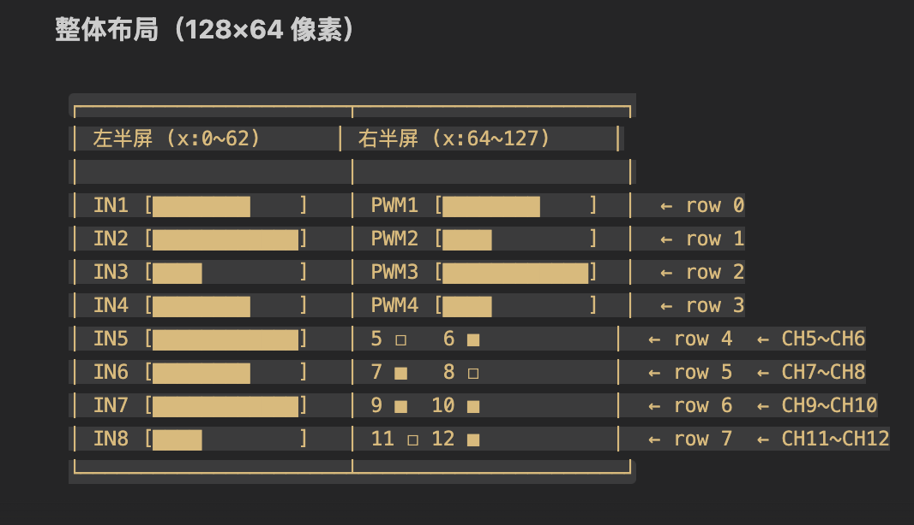

# PWMSwitch — 8 通道 RC PWM 信号转换器

## 概述

在遥控车无线控制中，接收机通常是调制的标准RC PWM(50HZ，1000~2000µs占空比)，而控制直流电机通常需要的是100%占空比的PWM信号，且频率通常需要1k以上（具体各频率特性参考后续介绍）。

所以就有了本项目，使用stm32做一个PWM信号转换，将接收机调试的RC PWM转为普通的PWM，然后用于驱动直流电机驱动器。

> 注：有条件的可以直接购买直流电机电调，与航模电调一致，可直接接RC PWM信号。

**PWMSwitch** 是一个基于 **STM32F103C8T6** (Blue Pill) 的通用 8 通道 RC 接收机 PWM 信号转换平台。它读取遥控接收机的多路 PWM 脉冲信号，经过用户自定义的映射逻辑处理后，输出 4 路 PWM + 4 路数字开关量信号，支持双电机正交编码器测速，并通过 **128×64 OLED** 实时显示所有通道状态。

默认内置一组**坦克差速转向**混控演示，但 `control.c` 中的转换逻辑完全开放，适用于各类 RC 信号转模拟/数字输出的场景。

> 适用场景：遥控设备信号转换、工业 RC 控制接口、机器人遥控器信号解码、自定义遥控映射等。

---

## 功能特性

- **8 通道 PWM 输入捕获** — 1µs 分辨率，支持标准 RC 信号 (1000~2000µs)
- **自由映射逻辑** — 编辑 `control.c` 即可自定义输入→输出转换规则
- **4 路 PWM 输出** — 10kHz 驱动频率，0~100% 占空比可调（运行时可变）
- **4 路数字输出** — ON/OFF 开关量，PA15 / PB3~PB5
- **双电机正交编码测速** — 软件 EXTI 解码，PB12~PB15，支持正反转检测
- **128×64 OLED 显示** — 实时显示 8 路输入 + PWM/数字输出 + 编码器位置
- **心跳 LED** — 根据输入信号动态变化闪烁频率
- **失效保护** — 信号丢失时输出自动回中位 (50%)

---

## 快速开始

### 硬件需求

| 组件 | 说明 |
|------|------|
| STM32F103C8T6 (Blue Pill) | 主控 |
| RC 接收机 (PWM 输出) | 8 通道标准信号 |
| 4 路电机驱动器 (如 L298N) | 或其它接受 PWM / 数字信号的设备 |
| SSD1306 128×64 OLED | I2C 接口 (地址 0x3C) |
| 电源 | 根据负载和接收机需求配置 |

### 引脚接线

| 功能 | MCU 引脚 | 连接目标 |
|------|----------|----------|
| PWM 输入 CH1~CH4 | PA0, PA1, PA2, PA3 | 接收机通道 1~4 |
| PWM 输入 CH5~CH8 | PA6, PA7, PB0, PB1 | 接收机通道 5~8 |
| PWM 输出 CH1~CH4 | PB6, PB7, PB8, PB9 | 电机/舵机/其它 PWM 设备 |
| 数字输出 CH1    | PA15 | 开关量 (原 JTDI) |
| 数字输出 CH2    | PB3  | 开关量 (原 JTDO) |
| 数字输出 CH3    | PB4  | 开关量 |
| 数字输出 CH4    | PB5  | 开关量 |
| 编码器 左A相  | PB12 | 左电机正交编码 A 相 (EXTI12) |
| 编码器 左B相  | PB13 | 左电机正交编码 B 相 (EXTI13) |
| 编码器 右A相  | PB14 | 右电机正交编码 A 相 (EXTI14) |
| 编码器 右B相  | PB15 | 右电机正交编码 B 相 (EXTI15) |
| OLED SCL | PB10 | SSD1306 SCL |
| OLED SDA | PB11 | SSD1306 SDA |
| 板载 LED | PC13 | (内置) |

### 固件烧录
项目基于vscode的platformIO插件平台，使用 STM32Cube HAL 库进行嵌入式软件开发。
```bash
# 安装 PlatformIO（如未安装）
pip install platformio

# 构建
pio run

# 烧录 (需 J-Link 调试器)
pio run --target upload
```

> 使用 J-Link 烧录，配置见 `platformio.ini`。

---

## 默认映射逻辑（坦克混控演示）

项目内置一组**坦克差速转向**混控作为示例，演示如何将 CH1/CH2 摇杆输入映射为双电机控制：

```
CH1 (转向) → steer = CH1 - 50   (-50 ~ +50)
CH2 (油门) → thr   = CH2 - 50   (-50 ~ +50)

左电机速度 = thr + steer  (限幅 ±100)
右电机速度 = thr - steer  (限幅 ±100)

正向 → PWM 正极输出，负向 → PWM 负极输出
```

CH5~CH8 直通为数字输出 (PA15, PB3~PB5)：输入 > 50% 时输出 ON，否则 OFF。

> PB12~PB15 已释放用作电机正交编码器输入 (详见 speed_sensor)。

### 自定义你的映射

编辑 `src/control.c` 中 `Control_Update()` 函数内标记的转换逻辑区间即可，无需改动框架代码。

```c
/* ============================================================
 *  从此处开始：输入 → 输出 转换逻辑
 *
 *  可用变量:
 *    in_ch_1 ~ in_ch_8   (uint8_t, 0~100)
 *  要赋值的变量:
 *    out_ch_1 ~ out_ch_4  (uint8_t, 0~100, PWM 占空比)
 *    out_ch_9 ~ out_ch_12 (uint8_t, 0 或 1, 数字输出 PA15/PB3~PB5)
 *
 *  编码器读数:
 *    SpeedSensor_GetPosition(MOTOR_LEFT/MOTOR_RIGHT) → int32_t
 *    (PB12~PB15 已分配给正交编码器输入)
 * ============================================================ */

// 在这里写你自己的映射逻辑

/* ============================================================
 *  转换逻辑结束
 * ============================================================ */
```

---

## 项目结构

```
PWMSwitch/
├── platformio.ini          # PlatformIO 构建配置
├── src/
│   ├── main.c              # 入口 + 主循环 + LED 心跳
│   ├── control.c/.h        # 控制逻辑 (输入→输出转换) ← 编辑此文件
│   ├── pwm_input.c/.h      # PWM 输入捕获驱动 (TIM2+TIM3)
│   ├── pwm_output.c/.h     # PWM 输出驱动 (TIM4)
│   ├── digital_output.c/.h # 数字输出驱动 (GPIO)
│   ├── speed_sensor.c/.h   # 正交编码器测速 (EXTI 软件解码)
│   ├── display.c/.h        # OLED 显示应用层
│   └── ssd1306.c/.h        # SSD1306 OLED 驱动 (I2C)
├── design.md               # 架构设计与流程图
└── README.md               # 本文件
```

---

## 技术参数

| 参数 | 值 |
|------|-----|
| MCU | STM32F103C8T6 (72MHz max, 配置 8MHz HSI) |
| 输入分辨率 | 1µs |
| 输入通道数 | 8 |
| 输出 PWM | 4 路，10kHz (运行时可通过 `pwm_output_freq_hz` 调整) |
| 输出数字 | 4 路 (0/1) — PA15, PB3~PB5 |
| 显示 | 128×64 OLED，I2C 400kHz |
| 更新周期 | 10ms |
| 开发环境 | PlatformIO + STM32Cube HAL |
| 调试器 | J-Link SWD |

---

## 适配车辆参数 (当前底盘)

本项目基于以下车辆平台进行 PID 闭环调试：

| 项目 | 参数 |
|------|------|
| 车型 | 履带车（坦克底盘） |
| 外形尺寸 | 276.5 × 267.4 × 91 mm |
| 自重 | 2.54 kg（含电池电控约 3.5 kg） |
| 负载能力 | 4 kg |
| 最高速度 | 1.1 m/s |
| 电机型号 | MG513 永磁有刷减速电机 |
| 电机电压 / 功率 | 12V / 4W |
| 减速比 | 1:30 |
| 减速前转速 | ~11000 RPM |
| 减速后转速 | 366 ± 26 RPM |
| 额定扭矩 | 1 kg·cm |
| 堵转扭矩 | 4.5 kg·cm |
| 编码器类型 | 霍尔编码器，13 PPR，自带上拉整形 |
| 编码器位置 | 电机轴上（减速器前） |
| 编码器分辨率 | 13 PPR × 4 正交 = 52 counts/电机转 |
| 满速编码器频率 | ~9500 counts/sec |
| H 桥驱动器 | 最大 PWM 频率 2 kHz (当前配置 1.8 kHz) |

> 如更换车辆平台，需重新标定 `PID_MAX_SPEED_CPS` 及 PID 参数，详见 `src/control.c` 顶部宏定义。

---

## 常见PWM驱动频率范围

| PWM频率       | 典型范围 | 特点            | 适用场景     |
| ----------- | ---- | ------------- | -------- |
| 20Hz～200Hz  | 低频   | 电机抖动明显，噪音大    | 实验、简单控制  |
| 200Hz～1kHz  | 较低频  | 效率较高，但可听噪声明显  | 低成本设备    |
| 1kHz～4kHz   | 中频   | 调速效果较好        | 玩具、小型设备  |
| 4kHz～16kHz  | 常用范围 | 噪音逐渐减小        | 工业控制     |
| 16kHz～25kHz | 高频   | 超出多数人耳听觉范围    | 智能设备、机器人 |
| 25kHz～50kHz | 很高频  | 电流更平滑，但开关损耗增加 | 高端控制器    |
| >50kHz      | 超高频  | 驱动器发热增加       | 特殊应用     |

## 不同电机常用PWM频率

| 电机类型         | 推荐PWM频率     |
| ------------ | ----------- |
| 小型有刷直流电机     | 10kHz～20kHz |
| 大功率有刷直流电机    | 2kHz～20kHz  |
| 无刷直流电机（BLDC） | 8kHz～30kHz  |
| 风扇电机         | 20kHz～25kHz |
| 电动工具电机       | 15kHz～25kHz |
| 智能机器人电机      | 16kHz～30kHz |

## oled显示逻辑



## License

MIT
